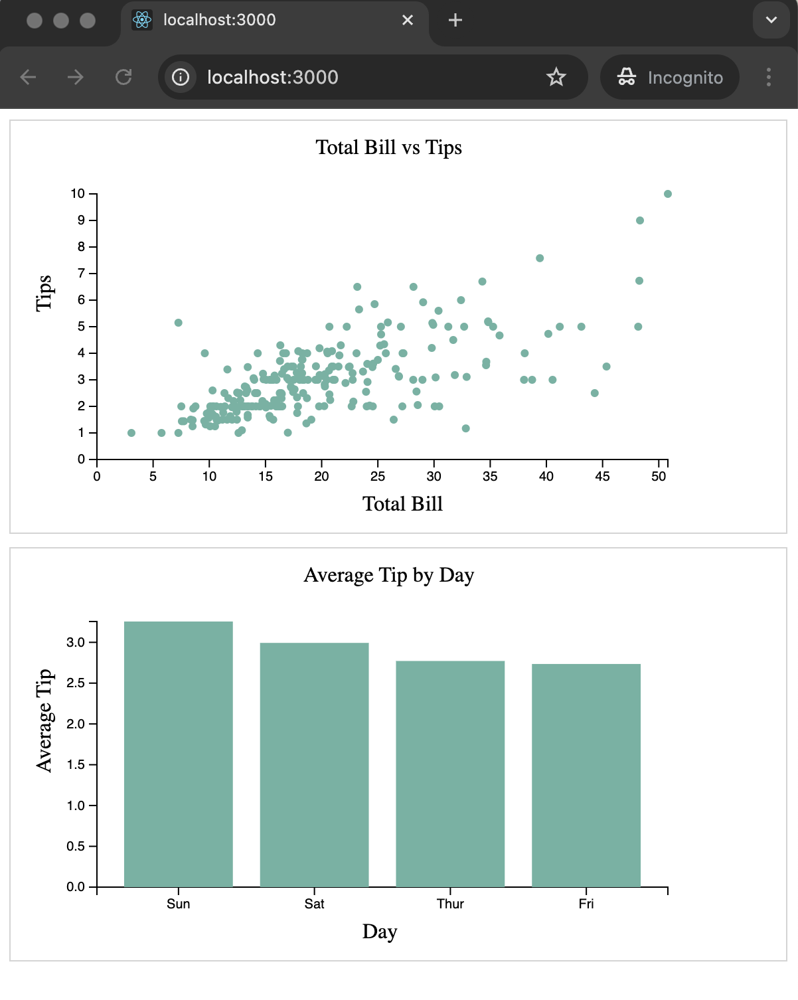

### Assignment 3: Data Visualization with React and CSV Integration
##### Submission: [live github page](https://katherinj.github.io/DataVisualization/assignment3)  
---
In a React project, create two child components named Child1 and Child2.
Load the [tips.csv](./public/assets/tips.csv) dataset within the App component and pass the data to the child components via props.

**Child1 Component:**
Create a scatter plot of total bill vs tips that includes axis labels and a title.

**Child2 Component:**
Create a bar chart to display the average tips for each day, also including axis labels and a title.

The expected output of the application will be as follows:

**Deployment:**  
Deploy your application to GitHub Pages. Ensure that the webpage is accessible online through a GitHub Pages URL.

**Submission:**  
Submit the following on Canvas:

- The parent component, all child components, and the CSS file.
- A link to your deployed application on GitHub Pages.

**Grading Rubric:**  
- [x] Child1 Component: Scatter Plot of Total Bill vs. Tips (50 Points)  
- [x] Scatter Plot Creation (25 Points)  
- [x] Axis Labels Position and Rotation (15 Points)  
- [x] Title Position (10 Points)  
- [x] Child2 Component: Bar Chart of Average Tips for Each Day (50 Points)  
- [x] Bar Chart Creation (25 Points)  
- [x] Axis Labels Position and Rotation (15 Points)  
- [x] Title Position (10 Points)

**_Note:_** Slight deviations in positioning are acceptable as long as they still look visually pleasing. However, significant misalignment will result in a loss of points. The color of the circles and bars should be #69b3a2, though you are free to use any color you prefer.