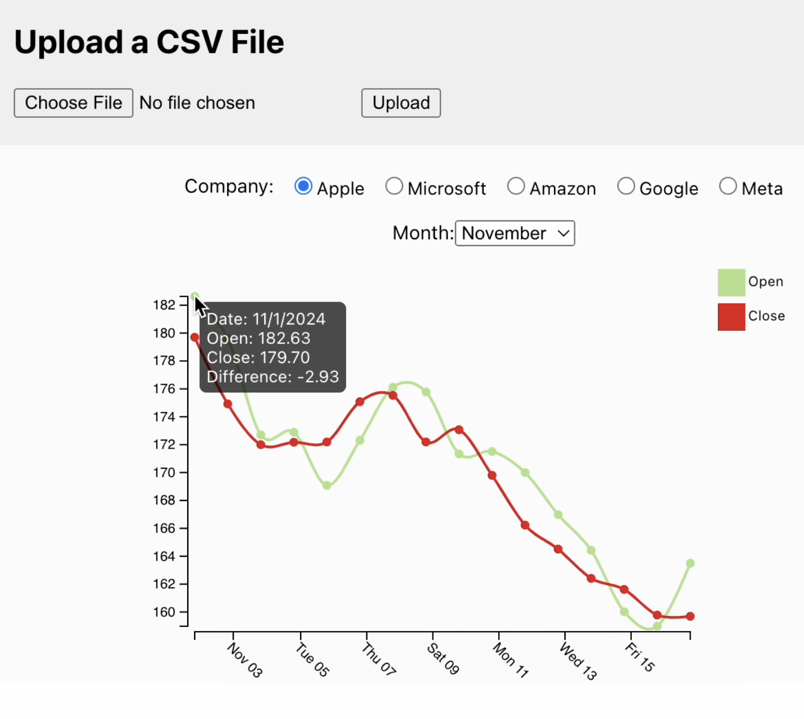

### Assignment 5: Stock Price Visualizer with D3 and React

##### Submission: [live github page](https://katherinj.github.io/DataVisualization/assignment5)

---

The goal of this assignment is to build a React component that integrates D3.js to visualize stock price data, specifically for companies like Apple, Microsoft, Amazon, Google, and Meta. The visualization will display the opening and closing prices over time, filtered by the selected company and month.

**React Component:**  
Use the provided React class component Child1 that receives CSV data from user upload containing stock prices for different companies.

The component should display an interactive chart with the following features:

- [ ] Plot two lines: one for the "Open" price and another for the "Close" price.
- [ ] The user should be able to select a company and a month from a dropdown and radio buttons, and the chart should update accordingly.

**State Management and Interactivity (40 points):**  
The component should have the following states:

- [ ] company: String storing the selected company (the default should be "Apple").
- [ ] selectedMonth: String representing the selected month (the default should be "November").
- [ ] Company Selector: Provide radio buttons to select a company. The chart should update when a different company is selected.
- [ ] Month Selector: Provide a dropdown menu to select a month. The chart should display data only for the selected month.

The chart should dynamically update through state when the user selects a new company or month.

**Chart Rendering (100 points):**

- [ ] Use scaleTime for the x-axis to represent time, and scaleLinear for the y-axis to represent prices. The domain of the y-axis should be set to the minimum and maximum values of both the "Open" and "Close" prices.
- [ ] Create a circle for each data pair and display tooltips showing details (date, open/close prices, and the difference) when hovering over the data points.
- [ ] Add a legend to differentiate the "Open" and "Close" lines with appropriate colors.
- [ ] Use D3.js to render the chart for "Open" and "Close" prices.

**Layout and Styling (10 points):**

- [ ] The layout should closely resemble the layout shown in the video.
- [ ] Use the colors { "Open": "#b2df8a", "Close": "#e41a1c" };
- [ ] Create Child1.css and put all your css styles inside it.

The expected output of the application will be as follows:

